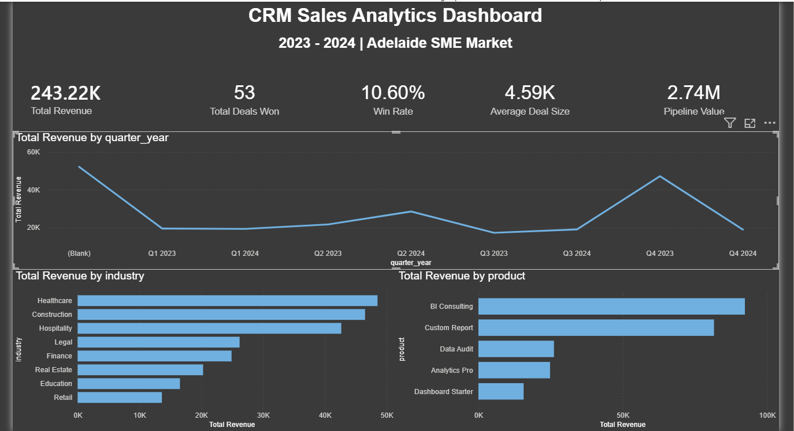
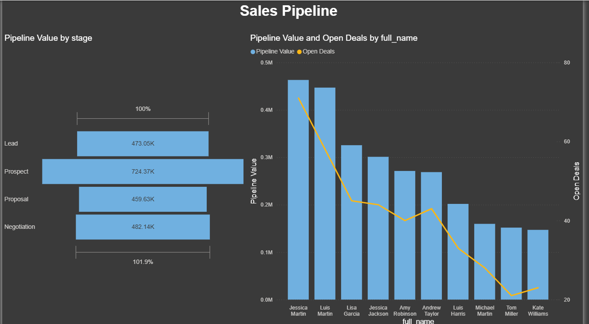
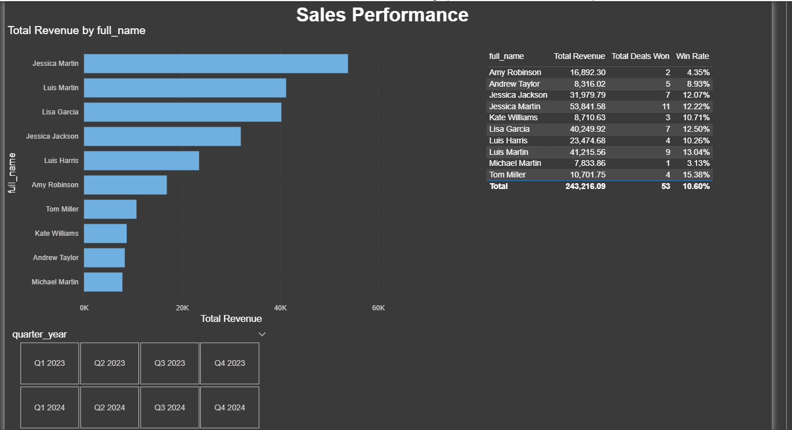

# CRM Sales Analytics Dashboard
### Power BI | DAX | Power Query | Data Cleaning | Business Intelligence



---

## Project Overview

This project delivers a fully interactive CRM Sales Analytics Dashboard built in Power BI, designed to give sales leadership a clear, data-driven view of revenue performance, pipeline health, and individual rep effectiveness across a two-year period (2023–2024).

The dataset simulates a B2B analytics consulting agency operating in the Adelaide SME market — selling products ranging from Dashboard Starter packages to full BI Consulting engagements across industries including Healthcare, Construction, Hospitality, and Legal.

The project covers the full analytics workflow: raw data ingestion, structured data cleaning with documented business decisions, star schema modeling, DAX measure development, and professional dashboard design across three report pages.

---

## Business Context

The company sells five analytics products to small and medium businesses:

| Product | Price Range |
|---|---|
| Dashboard Starter | ~$2,500 |
| Data Audit | ~$3,800 |
| Analytics Pro | ~$6,500 |
| Custom Report | ~$4,200 |
| BI Consulting | ~$9,000 |

Sales reps manage opportunities through a six-stage pipeline: Lead → Prospect → Proposal → Negotiation → Closed Won → Closed Lost. This dashboard tracks what matters most — how much revenue was generated, how healthy the pipeline is, and which reps are performing.

---

## Dashboard Pages

### Page 1 — Executive Summary
High-level KPIs and revenue trends for leadership and stakeholders.

- Total Revenue, Total Deals Won, Win Rate, Average Deal Size, Pipeline Value
- Revenue trend by quarter (2023–2024)
- Revenue breakdown by industry and product

**Key Insight:** Healthcare and Construction are the top revenue-generating industries. BI Consulting drives the highest revenue per deal among all products.

---

### Page 2 — Sales Pipeline
A real-time view of open pipeline health and rep-level workload.

- Pipeline funnel by stage (Lead through Negotiation)
- Pipeline value and open deal count by sales rep (combo chart)

**Key Insight:** Prospect stage holds the highest pipeline value ($724K), suggesting strong top-of-funnel activity but potential conversion bottlenecks moving into Proposal.


---

### Page 3 — Sales Performance
Rep-level performance analysis with period filtering.

- Revenue by sales rep (bar chart with cross-filtering)
- Performance table: Revenue, Deals Won, Win Rate per rep
- Quarter-year slicer (tile format) for period filtering

**Key Insight:** Overall Win Rate of 10.6% reflects 53 closed deals out of 500 total opportunities — consistent with B2B services industry benchmarks of 10–15%.

---

## Data Model

Star schema with 5 tables:

```
date_table (1) ──→ (*) sales
date_table (1) ──→ (*) opportunities_data [inactive]
sales_reps (1) ──→ (*) customers
sales_reps (1) ──→ (*) opportunities_data
customers  (1) ──→ (*) opportunities_data
opportunities_data (1) ──→ (*) sales
```

**Fact tables:** `sales`, `opportunities_data`  
**Dimension tables:** `customers`, `sales_reps`, `date_table`

---

## Data Cleaning Decisions

All cleaning was performed in Power Query (M language) within Power BI Desktop. Below are the documented decisions made during the cleaning process.

### customers (200 rows)
| Issue | Decision | Reasoning |
|---|---|---|
| Missing `industry` (~6%) | Replaced with `"Unknown"` | Industry is descriptive, not a business key. Row retained. |
| Missing `region` (~5%) | Replaced with `"Unknown"` | Region is descriptive. Row retained. |
| Missing `company_size` (~5%) + inconsistent formats (`N/A`, `unknown`, `small`) | Standardized all variants to `"Unknown"` | Ensures consistent filtering in visuals. |
| Missing `email` (8 rows) | Replaced with `unknown@unknown.com` | Email is a business key. Rows checked against `sales` table — at least one customer (C0003) had an associated Closed Won deal of $4,509. Deleting would break referential integrity. All 8 rows retained with placeholder. |
| Missing `lead_source` | Replaced with `"Unknown"` | Descriptive field, not used in calculations. |
| Mixed `registration_date` formats | Converted to Date type. Parse errors replaced with null. | Date is descriptive only and does not affect sales or pipeline calculations. Nulls retained. |

### opportunities_data (500 rows)
| Issue | Decision | Reasoning |
|---|---|---|
| Missing `stage` | Replaced with `"Unknown"` | Rows had significant estimated values (up to $12,751). Deleting would lose valid pipeline data. |
| Missing `estimated_value` | Retained as null | Unknown value ≠ zero. Null excluded from DAX averages automatically, preventing distortion of Average Deal Size. |
| Missing `probability_pct` | Imputed using business rule via Conditional Column | Probability is directly derivable from stage (Lead=10, Prospect=25, Proposal=50, Negotiation=75, Closed Won=100, Closed Lost=0). This is not invented data — it applies the CRM's own business logic. |
| Inconsistent `stage` values (mixed casing: `closed won`, `CLOSED WON`) | Manually standardized to Title Case | Ensures consistent filtering and DAX measure accuracy. |
| Mixed date formats across `created_date`, `expected_close_date`, `actual_close_date` | Converted all to Date type. Errors replaced with null. | Power Query parses multiple date formats on type conversion. Unparseable values treated as null. |
| Missing `actual_close_date` (~82%) | Retained as null | Expected behavior — only Closed Won and Closed Lost deals have a real close date. |
| Missing `lead_source`, `notes` | `lead_source` → `"Unknown"`. `notes` → left as null. | Notes is a free-text field not used in any calculation. No value in replacing with placeholder text. |
| Corrupt numeric values (`3705.55x`) | Removed trailing `x` via Replace Values before type conversion | Corruption introduced at data generation level. Fix applied pre-type-change to avoid errors. |

### sales (53 rows)
| Issue | Decision | Reasoning |
|---|---|---|
| Inconsistent `payment_method` casing (`BANK TRANSFER`, `bank transfer`) | Applied Trim, Clean, Capitalize Each Word | Single transformation resolves all casing variants simultaneously. |
| Inconsistent `revenue_recognised` values (`Yes`, `YES`, `yes`, `No`, `NO`, `no`) | Applied Trim, Clean, Capitalize Each Word | Same approach — resolves to `Yes` / `No` cleanly. |
| Missing `final_value` | Retained as null | Unknown revenue ≠ zero. Null prevents distortion of Total Revenue and Average Deal Size. |
| Missing `discount_pct` | Replaced with `0` | Missing discount means no discount was applied — zero is the correct business value here, not unknown. |

### sales_reps (10 rows)
| Issue | Decision | Reasoning |
|---|---|---|
| Inconsistent `team_level` casing (`SENIOR`, `MID`, `JUNIOR`) | Applied Trim, Clean, Capitalize Each Word | Resolves all variants to `Senior`, `Mid`, `Junior`. |
| Missing `annual_quota` (1 rep) | Replaced with team average ($97,000) | Standard imputation practice. Cannot be left null as it would exclude the rep from quota-based analysis. |
| Missing `hire_date` | Retained as null | Hire date is descriptive only. Cannot be inferred. |

### date_table (731 rows)
No cleaning required. Table was generated programmatically covering all days from 2023-01-01 to 2024-12-31.

---

## DAX Measures

### Base Metrics
```dax
Total Revenue = SUM(sales[final_value])

Total Deals Won = COUNTROWS(sales)

Avg Deal Size = DIVIDE([Total Revenue], [Total Deals Won])

Pipeline Value = 
SUMX(
    FILTER(
        opportunities_data,
        opportunities_data[stage] IN {"Lead", "Prospect", "Proposal", "Negotiation", "Unknown"}
    ),
    opportunities_data[estimated_value]
)

Win Rate = DIVIDE(COUNTROWS(sales), COUNTROWS(opportunities_data))

Open Deals = 
CALCULATE(
    COUNTROWS(opportunities_data),
    opportunities_data[stage] IN {"Lead", "Prospect", "Proposal", "Negotiation", "Unknown"}
)
```

### Time Intelligence
```dax
Revenue MTD = TOTALMTD([Total Revenue], date_table[date])

Revenue QTD = TOTALQTD([Total Revenue], date_table[date])

Revenue YTD = TOTALYTD([Total Revenue], date_table[date])

Revenue YoY = CALCULATE([Total Revenue], SAMEPERIODLASTYEAR(date_table[date]))
```

---

## Key Business Insights

- **$243K total revenue** generated from 53 closed deals over 2 years
- **$2.74M active pipeline** across 4 open stages — significant growth opportunity
- **Healthcare** is the highest-revenue industry; **BI Consulting** is the highest-revenue product
- **10.6% Win Rate** is consistent with B2B services benchmarks
- **Q1 2023** was the strongest quarter; pipeline shows recovery trending into Q4 2024
- **Jessica Martin and Luis Martin** lead the team in both pipeline value and open deal count

---

## Tools & Stack

| Tool | Purpose |
|---|---|
| Power BI Desktop | Data modeling, DAX, dashboard design |
| Power Query (M) | Data cleaning and transformation |
| DAX | Business metrics and time intelligence |
| Python | Synthetic dataset generation |
| GitHub | Version control and portfolio publishing |

---

## Repository Structure

```
crm-sales-analytics-powerbi/
│
├── data/
│   ├── customers.csv
│   ├── opportunities.csv
│   ├── sales.csv
│   ├── sales_reps.csv
│   └── date_table.csv
│
├── screenshots/
│   ├── executive_summary.png
│   ├── sales_pipeline.png
│   └── sales_performance.png
│
├── CRM_Sales_Analytics.pbix
└── README.md
```

---

## How to Use

1. Clone this repository
2. Open `CRM_Sales_Analytics.pbix` in Power BI Desktop
3. If data source paths need updating: Transform Data → Data Source Settings → update paths to your local `/data` folder
4. Explore the three report pages using slicers and cross-filtering

---

## Author

**Camilo** — Electronics Technician transitioning into Data Analytics  
Adelaide, South Australia  
GitHub: [Camilo-analytics](https://github.com/Camilo-analytics)

---

*Dataset is synthetic and generated for portfolio demonstration purposes.*
